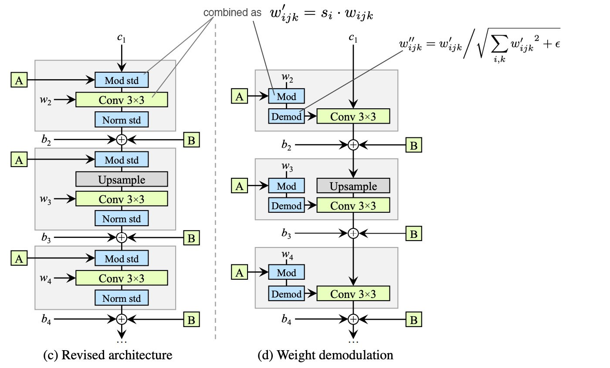

# StyleWavGAN

## Overview
This is a project that combines the advances of StyleGan2 and Dilated 1D convolutional
nets (wavenets), to create raw audio (music, speech, etc). The generator is a wavenet
adjusted for GAN style generation (n blocks of increasing size, dilation, and channel size)
with the redesigned generator normalization implemented. Each convolution is fed a style
which has been affine transformed by a synthesis network which is used to detangle
the style inputs as needed. As in the paper, the descriminator architecture mirrors the
generator architecture, without the style sythesis and normalization. Path length regularization
is implemented (as well as normal descriminator regularization) lazily.

StyleGan 2 normalization using weight modulation, as shown using a standard 2D convolutional
neural network. A is the output of the sythesis network which transforms the style
as needed.

The basic wavenet architecture showing n blocks of wavenet layers. Since the generator
implemented progressively increases in size, skip connections have to be adjusted.

## Training Models
In the `dataset.py` is an interface for the dataset processing needed for the model,
as well as an implementation for the FMA music dataset. Implementing Pytorch Dataset
object for the target dataset should not be too difficult. For possible audio datasets
that can be used for the model, I would take a look at [this](https://github.com/jim-schwoebel/voice_datasets)
github.

The basic training script is `train.py [args]`, with the choice dataset implemented

## References

[StyleGan2 Paper](https://arxiv.org/abs/1912.04958)
[Wavenet Paper](https://arxiv.org/abs/1609.03499)

## Examples and Pretrained Models
*TODO*
